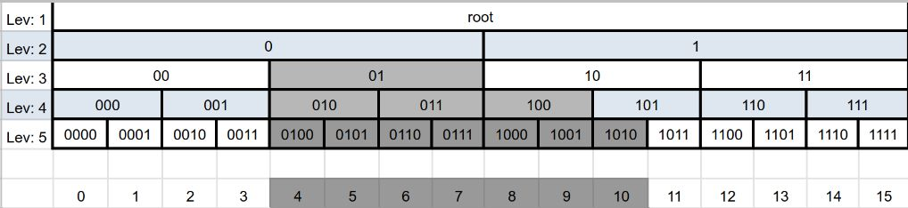

# Queryable Encryption Range Search

Range query is built upon equality query, except equality search is using a single search tag,
whereas range search requires multiple tags each representing a range. These tags are created
in such a way that any range could be represented as a compact set of these tags.

When creating a collection with an range-encrypted field, the user specifies the parameters
of an encrypted field, which are then used to generate tags for both search and insert. Delete
works same way as with equality-indexed values, except all operations would be
performed on multiple tags instead of one. Update operation works same way as for
equality indexed value, since it is a combination of delete and insert.

## Server-assisted Query

As with equality, there is a combination of server and client-side logic. Clients will
use mongo_crypt shared library to rewrite operations in order to use Queryable Encryption.

## Hypergraph

Range search is represented as combination of equality tag searches. Splitting of search 
space into ranges creates a structure called a "Hypergraph"

This exhibit illustrates how edges would be generated for integers with values from 0 to 15.
Every next level would cover larger ranges such that any search could be covered by limited
set of edges. In this example we will be searching for range 4-10 (inclusive), which is marked
by color.

## OSTType

For every field there is mapping, which uses field definition in schema to convert
value to following components:

- minimum possible value (always zero)
- maximum possible value
- mapped actual value

This mapping algorithm is called "OSTType". OSTType produces an unsigned integer, value of which
increases together with raw value. Result of this function is later used to generate
[edges](#edges) and [mincover](#mincover)

Conversion process is unique for every supported type, and could be found in 
[fle_crypto.h](https://github.com/10gen/mongo/blob/SERVER-63138/src/mongo/crypto/fle_crypto.h)
in following functions:

- getTypeInfo32
- getTypeInfo64
- getTypeInfoDouble
- getTypeInfoDecimal128

## Edges

For every OSTType, a set of edges could be generated. Multiple edges are generated for each value.
Each edge will generate a corresponding set of tags, which are then stored in their corresponding
auxiliary collection. For more information on tags, see [fle_protocol.md](fle_protocol.md). For
each range encrypted value, there will be n times the number of tags generated for a corresponding
equality document, where n is the number of edges for the document.

For example, in illustration above, value 4
will generate following edges: `[ 0100, 010, 01, 0, root ]`

Edges are generated using functionality declared in
[fle_crypto.h](https://github.com/10gen/mongo/blob/SERVER-63138/src/mongo/crypto/fle_crypto.h)
in following functions:

- getEdgesInt32
- getEdgesInt64
- getEdgesDouble
- getEdgesDecimal128

### Sparsity

In order to reduce number of edges generated for each record, it is sometimes practical to skip
storing certain levels. In that scenario, the skipped level can be represented as combination of
edges below skipped level.

For example, in illustration above, we may choose to exclude levels 2 and 4 (marked with blue).
Notice, that the lowest level (aka "leaf") can never be skipped. Skipping levels begins from
the top.

Sparsity is represented as a number from 1 to 4, where:

- sparsity = 1 - all levels stored
- sparsity = 2 - every 2nd level skipped
- sparsity = 3 - every 2nd and 3rd level skipped
- sparsity = 4 - every 2nd, 3rd, and 4th levels skipped

## minCover

Through the use of the hypergraph, range query can effectively be reduced to a set of equality queries.
In order to convert a range query to an effective equality query, we must identify a set of edges
which fully cover given range and nothing but given range. For example, if a search is requested for
values from 4 to 10, the minimum set of edges to search for would be: `[ 01, 100, 1010 ]`. This
minimum set of edges is called "minCover".

minCover is generated using functionality declared in
[fle_crypto.h](https://github.com/10gen/mongo/blob/SERVER-63138/src/mongo/crypto/fle_crypto.h)
in following functions:

- minCoverInt32
- minCoverInt64
- minCoverDouble
- minCoverDecimal128
