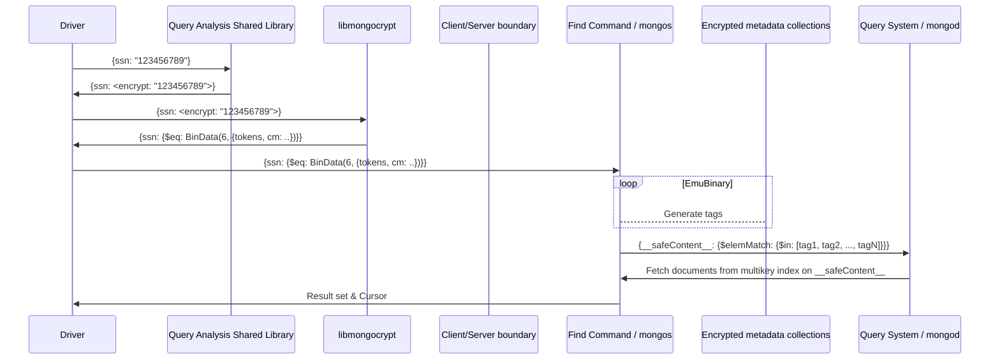

# Field Level Encryption Query Internals

This document is the architecture guide for the query-owned components of Field Level Encryption (FLE). The feature spans multiple teams and disciplines, and so this document will not be a comprehensive dive into components owned by Drivers, Server Security or the Cryptography teams. It will refer to concepts owned by those teams, and link out to documentation where relevant.

## Terms

- **FLE**: Field-level encryption. The internal name for the database features that encrypt specific fields in a collection end-to-end so that they are always unreadable on the server. The term is broad and covers multiple customer-facing features, but is still useful because much of the architecture and code is shared between them.
- **Client-side Field-Level Encryption**: The customer-facing name for the feature often referred to internally as **FLE1**. Launched in 2019, [CSFLE](https://www.mongodb.com/docs/manual/core/csfle/) gives users the ability to encrypt certain fields in the database on the driver side, and allows limited queryability if users select deterministic encryption, which offers less security than random encryption.
- **Queryable Encryption**: The customer-facing name for the feature often referred to internally as **FLE2**. Launched in 2022, [Queryable Encryption](https://www.mongodb.com/docs/manual/core/queryable-encryption/), sometimes abbreviated as QE, is an implementation of Structured Encryption. Structured Encryption is a novel cryptographic scheme originally developed at Brown University and then Aroki before the company was acquired by MongoDB. Queryable Encryption lets users query for encrypted values even when those values are randomly encrypted. Additionally, the encryption scheme supports more than just equality queries, with support available for range queries as well, and more on the way.
- **Deterministic Encryption**: A cryptosystem which always produces the same ciphertext for a given plaintext and key, even over separate executions of the encryption algorithm ([Wikipedia](https://en.wikipedia.org/wiki/Deterministic_encryption)). Deterministic encryption leaks information about the statistical distribution of fields. For example, if `age` is encrypted deterministically, an attacker with access to the ciphertext can use available statistics about the age distribution in the United States to determine which ciphertext corresponds to which plaintext age.
- **Random Encryption**: A cryptosystem which adds some randomness to the output such that encrypting the same plaintext with the same key multiple times will generally yield different ciphertexts ([Wikipedia](https://en.wikipedia.org/wiki/Probabilistic_encryption)). This prevents the same kind of statistical attack possible with deterministic encryption.
- **Query Analysis**: Functionality that lets users write queries as if they were against unencrypted data and have them automatically rewritten to support encrypted collections. Query analysis is developed in the enterprise repository and is only available to paying enterprise customers.
  - Also referred to as **Automatic Encryption** or **Implicit Encryption**
- **Manual Encryption** or **Explicit Encryption**: The term for when users bypass query analysis and manually create encrypted payloads to stand in for literals in their queries. This functionality is exposed by driver helpers and still makes use of the encryption functionality in libmongocrypt, but _does not_ rely on query analysis.
- **Encryption Placeholder** or **"Intent-to-encrypt" placeholder**: A BinData blob which never leaves the client. Produced by query analysis and consumed by the encryption/cryptography system. It indicates that a literal in the corresponding position in the original query should be marked for encryption by the cryptography code.
- **Encrypted Payload**: The actual BinData blob which is sent from the client to the server. For FLE1, this is simply the ciphertext of the encrypted field. In FLE2, this encrypted payload differs between insert and find, and contains the necessary cryptographic tokens required to update and query the encrypted metadata collections.
- **Encrypted Index**: A term for the set of data structures that allow users to query randomly encrypted fields with different predicates in FLE2. At the time of writing, there are two encrypted indexes which are available: equality and range.

## High-level overview

At a high-level, FLE is implemented as a series of syntactic rewrites on a user query that transforms the query from one that acts on unencrypted data into one that is able to query encrypted data. For FLE2, these rewrites happen on both the client and the server. Here is the general flow for an equality query with the find command in FLE2:



Query analysis is developed as part of the server codebase, but is [compiled as its own "shared library"](https://github.com/10gen/mongo-enterprise-modules/blob/4c30c843ea74947944d6288b467e93c951a4190f/src/fle/query_analysis/SConscript#L8) which can be dynamically loaded by `libmongocrypt` so that it can be executed on the client side. When FLE1 was first released, query analysis ran in a separate process called `mongocryptd` that communicated with libmongocrypt over a local network connection. The protocol and interaction between query analysis and encrypted payload generation still operate in the same way. As a beneficial side-effect, all intent-to-encrypt placeholders are [defined in the IDL](https://github.com/10gen/mongo/blob/67b565edf1a1ae3157a427ea0488037deb479c03/src/mongo/crypto/fle_field_schema.idl#L117-L178).

FLE supports both find `MatchExpressions` and aggregation `Expressions`. Because these are two separate abstract syntax trees internally, there are different internal structures and functions for traversing and rewriting each kind of syntax tree. While we try to share as much code as possible throughout the system, there is only so much commonality between traversing two ASTs where one is not a subset of the other.

The rest of this document will explain each part of this rewrite, and how it is implemented in our codebase.

## Client-side query analysis and rewrites

Client-side query analysis allows users to write queries against encrypted data just as if it was unencrypted. If a query attempts to do something which is not supported by the underlying encryption, it is caught during query analysis and returned to the user as an error before the query is sent to the server.

Contrary to its name, query analysis also rewrites constants in [insert](https://github.com/10gen/mongo-enterprise-modules/blob/41e0f887c978c9ecc320e96e7ebf6cf20eac17a7/src/fle/query_analysis/query_analysis.cpp#L632) and [update commands](https://github.com/10gen/mongo-enterprise-modules/blob/41e0f887c978c9ecc320e96e7ebf6cf20eac17a7/src/fle/query_analysis/query_analysis.cpp#L293) so that fields are properly marked for encryption before those operations.

While `mongocryptd` is no longer used in production deployments, it is still used to test query analysis on its own in the enterprise repository without needing to build a driver. Examples are mostly in the [`jstests/fle`](https://github.com/10gen/mongo-enterprise-modules/blob/master/jstests/fle/fle_find.js) and [`jstests/fle2_query_analysis`](https://github.com/10gen/mongo-enterprise-modules/blob/master/jstests/fle2_query_analysis/range.js) directories.

### The client-side encryption protocol

Query analysis is just one step in the process of properly encrypting queries:

1. Query analysis takes in an input query sent from a driver -- either a `MatchExpression` or a `Pipeline` -- and outputs a query where constants which are compared to encrypted fields have been replaced with intent-to-encrypt placeholders.
2. Now that the query has been marked for encryption, it is sent to the cryptography section of `libmongocrypt` where the intent-to-encrypt placeholders are replaced with encrypted payloads with all the information necessary to complete the given server action (insert, find, aggregate, etc.).
3. The driver then takes the fully encrypted query from libmongocrypt and sends it off to the server for further processing.

> **Debugging note:** Intent-to-encrypt placeholders as well as the final encrypted payload are both encoded as BinData blobs rather than plain BSON objects, which are completely opaque when they are printed out in debug logs and test assertions. You can use [CyberChef](<https://gchq.github.io/CyberChef/#recipe=From_Base64('A-Za-z0-9%2B/%3D',true,true)Drop_bytes(0,1,false)BSON_deserialise()&input=QS9BQUFBQVFkQUFDQUFBQUVHRUFBd0FBQUFWcmFRQVFBQUFBQkFFalJXZUpxODN2N2N1cGgyVkRJUUVGYTNVQUVBQUFBQVFCSTBWbmlhdk43KzNMcVlkbFF5RUJBM1lBa1FBQUFBTmxaR2RsYzBsdVptOEFYd0FBQUFGc2IzZGxja0p2ZFc1a0FBQUFBQUFBQVBEL0NHeGlTVzVqYkhWa1pXUUFBUkIxY0hCbGNrSnZkVzVrQUJjQUFBQUlkV0pKYm1Oc2RXUmxaQUFBRUdsdVpHVjRUV2x1QUFBQUFBQVFhVzVrWlhoTllYZ0F5QUFBQUFBUWNHRjViRzloWkVsa0FBQUFBQUFRWm1seWMzUlBjR1Z5WVhSdmNnQURBQUFBQUJKamJRQUJBQUFBQUFBQUFCSnpBQUVBQUFBQUFBQUFBQT09>) to decode and parse these blobs into readable objects during development.

### Collection schema

In order to properly encrypt constants in queries and warn users when they write queries that are not supported by FLE, query analysis needs information about the schema of the collection. To keep track of what fields are encrypted and what type each field holds we maintain an [EncryptionSchemaTree](https://github.com/10gen/mongo-enterprise-modules/blob/master/src/fle/query_analysis/encryption_schema_tree.h) data structure. The SchemaTree keeps track of what fields are encrypted or not encrypted. Encrypted nodes in the schema tree also have a [ResolvedEncryptionInfo](https://github.com/10gen/mongo-enterprise-modules/blob/master/src/fle/query_analysis/resolved_encryption_info.h) object, which holds metadata about the type of encryption involved. This metadata includes:

- Algorithm (Deterministic or Random for FLE1. Unindexed, Equality or Range for FLE2)
- BSONType
- Additional metadata about FLE2 query type (like min/max bounds for range index)

FLE1 and FLE2 use different data structures as the input to the encryption schema tree. FLE1 makes use of JSON Schema and the `$jsonSchema` validator option in MongoDB. FLE2 has a new [encrypted field config](https://github.com/10gen/mongo/blob/67b565edf1a1ae3157a427ea0488037deb479c03/src/mongo/crypto/encryption_fields.idl#L131-L154) which is an optional parameter that can be added when [creating a collection](https://github.com/10gen/mongo/blob/67b565edf1a1ae3157a427ea0488037deb479c03/src/mongo/db/commands/create.idl#L195-L199). This struct must be sent along with every CRUD operation on an encrypted collection.

There are [functions to parse both of these structures](https://github.com/10gen/mongo-enterprise-modules/blob/41e0f887c978c9ecc320e96e7ebf6cf20eac17a7/src/fle/query_analysis/encryption_schema_tree.h#L142-L157) into the same encryption schema tree data structure, which allows query analysis for equality predicates to be mostly shared between FLE1 and FLE2. A schema tree [keeps track](https://github.com/10gen/mongo-enterprise-modules/blob/41e0f887c978c9ecc320e96e7ebf6cf20eac17a7/src/fle/query_analysis/encryption_schema_tree.h#L332) of whether it was parsed from a FLE1 or FLE2 context.

### Find command and `MatchExpressions`

Query analysis for MatchExpressions is located in [`fle_match_expression.cpp`](https://github.com/10gen/mongo-enterprise-modules/blob/master/src/fle/query_analysis/fle_match_expression.cpp). The `FLEMatchExpression` class takes in a unique_ptr for a `MatchExpression`, and makes all rewrites necessary in [its constructor](https://github.com/10gen/mongo-enterprise-modules/blob/41e0f887c978c9ecc320e96e7ebf6cf20eac17a7/src/fle/query_analysis/fle_match_expression.cpp#L27).

Rewrite passes, named `replaceEncrypted*Elements()`, make use of the [`numChildren()`](https://github.com/10gen/mongo/blob/67b565edf1a1ae3157a427ea0488037deb479c03/src/mongo/db/matcher/expression.h#L354) and [`getChild()`](https://github.com/10gen/mongo/blob/67b565edf1a1ae3157a427ea0488037deb479c03/src/mongo/db/matcher/expression.h#L360) `MatchExpression` member functions in order to traverse a `MatchExpression` tree recursively, and switch on the result of [`matchType()`](https://github.com/10gen/mongo/blob/67b565edf1a1ae3157a427ea0488037deb479c03/src/mongo/db/matcher/expression.h#L346) in order to dispatch different behavior based on the type of MatchExpressions.

### Aggregate command

#### Aggregation `Expressions`

The `Expression` class hierarchy represents a much more expressive syntax tree than `MatchExpressions`. Unlike our simple iteration for MatchExpressions, we make use of the walker and visitor patterns to traverse `Expression` trees.

##### Expression Walkers

Aggregation Expressions are traversed using the [`expression_walker::walk()`](https://github.com/10gen/mongo/blob/67b565edf1a1ae3157a427ea0488037deb479c03/src/mongo/db/pipeline/expression_walker.h#L137) template. The walker classes used for agg expression query analysis are called "intenders" because their purpose is to add intent-to-encrypt placeholders to expressions.

Walkers will traverse the entire `Expression` tree, calling their `preVisit()`, `inVisit()`, and `postVisit()` methods for each sub-`Expression` along the way. In order to make sure all `Expression`s are handled in a type-safe way, the intenders [delegate to `ExpressionVisitor`s for each `*Visit()` function](https://github.com/10gen/mongo-enterprise-modules/blob/4c30c843ea74947944d6288b467e93c951a4190f/src/fle/query_analysis/agg_expression_encryption_intender_base.h#L1506-L1515). The visitor interface is [defined in the community repository](https://github.com/10gen/mongo/blob/master/src/mongo/db/pipeline/expression_visitor.h). You can learn more about the visitor pattern from [sections `5.3.1` and `5.3.2` of _Crafting Interpreters_](https://craftinginterpreters.com/representing-code.html#the-expression-problem).

Be wary of some overloaded terms in use with the intenders. Classes that represent Expression walkers directly have `pre`-, `in`-, and `postVisit()` functions. Those functions on the walker class delegate to sub-classes of [`ExpressionMutableVisitor`](https://github.com/10gen/mongo/blob/67b565edf1a1ae3157a427ea0488037deb479c03/src/mongo/db/pipeline/expression_visitor.h#L374), which is another class. This can get confusing, but in short, the walker is responsible for traversing the tree of `Expression`s and maintaining intermediate state, while the visitor is responsible for dispatching different behavior based on the dynamic type of each Expression.

Most traversal behavior is shared between all encrypted predicate analysis. This logic is encapsulated in the base intender found in [agg_expression_encryption_intender_base.h](https://github.com/10gen/mongo-enterprise-modules/blob/master/src/fle/query_analysis/agg_expression_encryption_intender_base.h).

##### Subtree Stacks

As the walker visits each expression in an expression tree, it must keep track of the context of the current expression. Encryption is only allowed in contexts that will use the encrypted value for a comparison and the result of the comparison will be used as a boolean. To keep track of this state, the visitor maintains a stack where the top value of the stack represents the context in which its children should be evaluating encrypted fields. We refer to one of these contexts as a [Subtree](https://github.com/10gen/mongo-enterprise-modules/blob/aaadc8eed7e072a30b4f0fa49a0b991bd7aed5ee/src/fle/query_analysis/agg_expression_encryption_intender_base.h#L46). A Subtree can be one of the following types:

1. Forwarded
   - A forwarded context means the data will be sent to the user and not be used for any processing. All values are allowed here, as it is permitted to return both unencrypted and encrypted values as query results.
2. Compared
   - This context indicates that the output of this context will be used in a comparison that will produce a boolean. For FLE1 this meant that all children in a compared subtree must have an encryption type that allowed comparison. In FLE2 comparison between encrypted fields is forbidden. The only allowed comparisons in a Compared Subtree are unencrypted fields to each other or literals, or a single encrypted field path compared to a literal.
   - A notable use of a ComparedSubtree is when a comparison operator (eq/neq/gt/lt/gte/lte) is found to be comparing an encrypted field path to a constant. In this case, the ComparedSubtree keeps track of the field path. Later in a traversal if an encrypted field path is found, this value is checked. If the encrypted field path was expected it is permitted, in other contexts an encrypted field path is not allowed.
   - A ComparedSubtree can have subtypes to track the encryption type: Unknown, NotEncrypted, or Encrypted
3. Evaluated
   - The result of this Subtree will be used for an operation that will produce a result other than a boolean. No encrypted fields support non-boolean comparisons, so encrypted field references are not allowed in an EvaluatedSubtree.

The Expression Visitor functions described above are responsible for [entering the correct Subtree type](https://github.com/10gen/mongo-enterprise-modules/blob/aaadc8eed7e072a30b4f0fa49a0b991bd7aed5ee/src/fle/query_analysis/agg_expression_encryption_intender_base.cpp#L57) (in `preVisit()` or `inVisit()` and [exiting the Subtree they entered](https://github.com/10gen/mongo-enterprise-modules/blob/aaadc8eed7e072a30b4f0fa49a0b991bd7aed5ee/src/fle/query_analysis/agg_expression_encryption_intender_base.h#L177) (if any, in `inVisit()` or `postVisit()`).

#### Aggregation stages

Aggregation stages like $lookup, $project and $group have the potential to completely change the schema of documents flowing through the pipeline. We keep track of these schema transformations for many stages inside of [`fle_pipeline.cpp`](https://github.com/10gen/mongo-enterprise-modules/blob/master/src/fle/query_analysis/fle_pipeline.cpp) . Supported document sources are [registered](https://github.com/10gen/mongo-enterprise-modules/blob/4c30c843ea74947944d6288b467e93c951a4190f/src/fle/query_analysis/fle_pipeline.cpp#L789-L791) along with functions which transform one schemaTree into another.

Stages can use the [`getOutputSchema()`](https://github.com/10gen/mongo-enterprise-modules/blob/aaadc8eed7e072a30b4f0fa49a0b991bd7aed5ee/src/fle/query_analysis/aggregate_expression_intender.h#L54), which [implements another expresion walker](https://github.com/10gen/mongo-enterprise-modules/blob/aaadc8eed7e072a30b4f0fa49a0b991bd7aed5ee/src/fle/query_analysis/expression_schema_walker.cpp#L1253-L1259) to schema-check agg expressions.

Intermediate schemas are kept track of in a [pipeline metadata tree](https://github.com/10gen/mongo/blob/67b565edf1a1ae3157a427ea0488037deb479c03/src/mongo/db/pipeline/pipeline_metadata_tree.h#L55-L63) and [collapsed into a final output schema using the metadata tree](https://github.com/10gen/mongo-enterprise-modules/blob/4c30c843ea74947944d6288b467e93c951a4190f/src/fle/query_analysis/fle_pipeline.cpp#L859-L865).

### Predicate rewrites

While predicate rewrites for match and agg are implemented separately (match rewrites live in `fle_match_expression.cpp` while agg rewrites live in their own `*_intender.cpp` files), they are implementing the same logic for a given predicate over different syntax trees. The sections below will explain the rewrites, and link to the relevant code for each syntax.

#### Equality Pass

Encrypted equality predicates are the only predicates supported by FLE1, and FLE2 equality is built directly on top of this foundation. The equality pass will replace literals with encrypted placeholders when the literal is being compared to a field that is encrypted in the collection schema. Since this pass is shared between FLE1 and FLE2, the `schemaTree` is used to determine whether or not query analysis is operating over a FLE1 or a FLE2 query to split logic when the rules diverge [in match](https://github.com/10gen/mongo-enterprise-modules/blob/41e0f887c978c9ecc320e96e7ebf6cf20eac17a7/src/fle/query_analysis/fle_match_expression.cpp#L134-L138) and [agg](https://github.com/10gen/mongo-enterprise-modules/blob/4c30c843ea74947944d6288b467e93c951a4190f/src/fle/query_analysis/agg_expression_encryption_intender_base.cpp#L386-L391).

Relevant files/functions:

- Match: [`replaceEncryptedEqualityElements()`](https://github.com/10gen/mongo-enterprise-modules/blob/41e0f887c978c9ecc320e96e7ebf6cf20eac17a7/src/fle/query_analysis/fle_match_expression.cpp#L160).
- Agg: [`agg_expression_encryption_intender`](https://github.com/10gen/mongo-enterprise-modules/blob/master/src/fle/query_analysis/agg_expression_encryption_intender.cpp)

#### Range Pass

For FLE2 range indexes, the rewrite looks for \$gt, \$lt, \$gte and \$lte operators over encrypted fields and replaces their right hand sides with intent-to-encrypt placeholders.

A complication to the range pass is that encrypted range queries operate over two-sided ranges with both an upper and lower bound. MongoDB operators are all one-sided -- two-sided ranges are constructed with a `$and` operator surrounding a lower bound and upper bound operator. This means that, unlike for equality, query analysis cannot just look at leaf comparison operators to replace literals. It must also look through the children of a `$and` expression ([match](https://github.com/10gen/mongo-enterprise-modules/blob/41e0f887c978c9ecc320e96e7ebf6cf20eac17a7/src/fle/query_analysis/fle_match_expression.cpp#L432), [agg](https://github.com/10gen/mongo-enterprise-modules/blob/4c30c843ea74947944d6288b467e93c951a4190f/src/fle/query_analysis/aggregate_expression_intender_range.cpp#L296)) to see if there are any queries with two sides, and perform a different rewrite if any are found.

An important note about encrypted range queries is that the encrypted payload for a two-sided range cannot be split up on the client-side and intersected on the server. To avoid doubling up payloads sent to the server, we only place the actual encrypted payload under one operator, and place a "stub" BinData blob under the other operator. We then have an extra [validation pass on the server-side](https://github.com/10gen/mongo/blob/master/src/mongo/db/query/fle/range_validator.h) which ensures that the payload and stub have not been tampered with after they are generated client-side.

While it is possible in theory to produce two-sided ranges for many complex query predicates through boolean normalization and simplification, there are currently very few boolean simplifications present in MongoDB. Therefore, query analysis relies on two-sided ranges having both operators representing endpoints directly under a `$and` expression.

Relevant files/functions:

- Match: [`replaceEncryptedRangeElements()`](https://github.com/10gen/mongo-enterprise-modules/blob/4c30c843ea74947944d6288b467e93c951a4190f/src/fle/query_analysis/fle_match_expression.cpp#L512)
- Agg: [`aggregate_expression_intender_range.cpp`](https://github.com/10gen/mongo-enterprise-modules/blob/master/src/fle/query_analysis/aggregate_expression_intender_range.cpp)

## Server-side query rewriting

For FLE1, query analysis and libmongocrypt perform all the rewrites necessary for the server to answer queries against deterministically encrypted fields -- the server just needs to compare BinData as it normally would.

For FLE2, all encrypted fields are randomly encrypted and cannot be directly compared. FLE2 queries are rewritten on the server to be executed against queryable metadata that is stored alongside documents in the collection. Unlike query analysis, which lives in the enterprise repository, the server rewrite is part of the community distribution and lives in the [`mongo/db/query/fle`](https://github.com/10gen/mongo/tree/master/src/mongo/db/query/fle) directory.

The full cryptographic details are beyond the scope of this Query architecture guide, as the creation and maintenance of encrypted indexes and metadata is owned by the Server Security team. However, some high-level details relevant to query rewrites are presented in the next section.

### Executing FLE2 queries

At a high level, there are two possible execution strategies for FLE2 predicates, which are described in the sub-sections below. Both strategies are implemented as syntactic rewrites of the input query. The queries then flow through the optimization and execution systems normally.

For those interested in learning more than will be presented in the brief overview below, here are some resources:

- OST-1 Cryptographic specification (TODO: find up-to-date OST-1 link)
- [Security team protocol guide](https://github.com/10gen/mongo-enterprise-modules/blob/master/docs/fle/fle_protocol.md)
- [Range index algorithm walkthrough](https://github.com/10gen/mongo-enterprise-modules/blob/master/docs/fle/fle_range.md)

#### Encrypted index access

Every document in an encrypted collection has an additional autogenerated array field called `__safeContent__` which contains an array of BinData blobs, called "tags" in the code and the OST-1 specification, that indicate which predicates the document matches.

When receiving a query that contains an encrypted predicate, the server uses the encrypted payload to generate a list of all BinData blobs that are stored in the `__safeContent__` arrays of documents which match the predicate for which the payload was generated on the client-side. The predicate is then rewritten in-place from a query on the encrypted field to a query for tags in `__safeContent__`.

`{ssn: {$eq: BinData(6, find_payload)}}`
becomes:
`{__safeContent__: {$in: [tag1, tag2, ..., tagN]}}`

Tags are generated from a set of cryptographic tokens in the [`readTags()`](https://github.com/10gen/mongo/blob/67b565edf1a1ae3157a427ea0488037deb479c03/src/mongo/crypto/fle_tags.cpp#L202) function.

#### Encrypted collection scan

The number of tags that need to be generated grows with every document that is inserted to the collection with a given key/value pair. This leads to situations where predicates with poor selectivity can require a number of tags that will exceed the 16MB BSON document size limit. When this happens, we fall back to an encrypted collection scan that doesn't make use of the multikey index on `__safeContent__`. There are `$_internalFle` aggregation operators ([equality](https://github.com/10gen/mongo/blob/67b565edf1a1ae3157a427ea0488037deb479c03/src/mongo/db/pipeline/expression.h#L2227), [range](https://github.com/10gen/mongo/blob/67b565edf1a1ae3157a427ea0488037deb479c03/src/mongo/db/pipeline/expression.h#L2199)) which use a key sent as part of the encrypted payload to decrypt a small section of the encrypted data in an encrypted field to determine if the document matches the predicate the key was generated for, or not.
`{ssn: {$eq: BinData(6, find_payload)}}`
becomes:
`{$expr: {$_internalFleEqual: {field: "$ssn", server: BinData(6, ServerZerosEncryptionToken)}}}`
where `ServerZerosEncryptionToken` is derived from the `ServerDerivedFromDataToken` included in the payload.

The code for decrypting this part of the payload is defined in [this header](https://github.com/10gen/mongo/blob/master/src/mongo/crypto/fle_crypto_predicate.h) and in [fle_crypto.cpp](https://github.com/10gen/mongo/blob/67b565edf1a1ae3157a427ea0488037deb479c03/src/mongo/crypto/fle_crypto.cpp#L3647). As the name implies, encrypted collection scans require a full collection scan in order to return results, so they are less efficient than `__safeContent__` disjunction queries.

### Command Entrypoints

`MatchExpression`s can show up in a wide array of commands, each with their own IDL struct representing the schema of the command. In `server_rewrite.h`, we define the interface for rewriting any encrypted predicates in filters in each of these commands. All of these have entrypoints `void processFLE<CMD>` in [`fle_crud.h`](https://github.com/10gen/mongo/blob/master/src/mongo/db/fle_crud.h), with many having different variants for mongod and mongos. These process functions are called in the command entrypoints for mongod and mongos, right after parsing the command, before any other processing or execution has occurred. For an example, the snippets for `find` are [here](https://github.com/10gen/mongo/blob/67b565edf1a1ae3157a427ea0488037deb479c03/src/mongo/s/commands/cluster_find_cmd.h#L300-L304) and [here](https://github.com/10gen/mongo/blob/67b565edf1a1ae3157a427ea0488037deb479c03/src/mongo/db/commands/find_cmd.cpp#L93-L97). Most entrypoints to the FLE code for separate commands can be found by grepping for usages of the [`shouldDoFLERewrite()`](https://github.com/10gen/mongo/blob/67b565edf1a1ae3157a427ea0488037deb479c03/src/mongo/db/fle_crud.h#L216-L227) helper.

### Transactions, `mongos` and `mongod`

Generating tags for an encrypted predicate requires reading documents stored in encrypted metadata collections during the [`EmuBinary` procedure](https://github.com/10gen/mongo/blob/67b565edf1a1ae3157a427ea0488037deb479c03/src/mongo/crypto/fle_crypto.cpp#L433). In order to maintain a consistent state of the data collection and its encrypted metadata collections the entire encrypted rewrite happens inside of a transaction. FLE2 makes use of the [internal transaction API](https://github.com/10gen/mongo/blob/master/src/mongo/db/transaction/transaction_api.h) to create a transaction before rewriting filter expressions.

The transaction API requires slightly different parameters when run on mongos in a sharded cluster versus when it's run on mongod as part of a replicaset. These are implemented as separate functions, like [`processFLEFindS` and `processFLEFindD`](https://github.com/10gen/mongo/blob/67b565edf1a1ae3157a427ea0488037deb479c03/src/mongo/db/fle_crud.h#L169-L181). The mongos implementations live in `fle_crud.cpp`, while the mongod versions live in [`fle_crud_mongod.cpp`](https://github.com/10gen/mongo/blob/master/src/mongo/db/fle_crud_mongod.cpp) which is [only linked into mongod](https://github.com/10gen/mongo/blob/67b565edf1a1ae3157a427ea0488037deb479c03/src/mongo/db/SConscript#L919).

The `processFLE<CMD>` functions defined in `fle_crud.cpp` call into shared logic defined in [`fle/server_rewrite.h`](https://github.com/10gen/mongo/blob/master/src/mongo/db/query/fle/server_rewrite.h) which sets up the internal transaction, performs the actual query rewrite, commits the transaction and returns the resulting rewritten query to the caller.

### `QueryRewriter`

Once `server_rewrite.cpp` has set up the transaction and extracted the filter from the command, it passes on the BSONObj containing the filter to the [QueryRewriter](https://github.com/10gen/mongo/blob/master/src/mongo/db/query/fle/query_rewriter.h). This rewriter is responsible for traversing [`MatchExpression`s](https://github.com/10gen/mongo/blob/67b565edf1a1ae3157a427ea0488037deb479c03/src/mongo/db/query/fle/query_rewriter.h#L90) and [Agg `Expression`s](https://github.com/10gen/mongo/blob/67b565edf1a1ae3157a427ea0488037deb479c03/src/mongo/db/query/fle/query_rewriter.h#L97), and calling individual rewrites for different encrypted predicates.

#### Registering rewrites

While the rewriter class is responsible for traversing expressions, actual rewrites are specified by subclasses of [`EncryptedPredicate`](https://github.com/10gen/mongo/blob/master/src/mongo/db/query/fle/encrypted_predicate.h). This abstract class defines virtual methods for generating tags from the specific encrypted payload, along with performing rewrites to `$in` over `__safeContent__` as well as to an encrypted collscan operator. The superclass defines a [`rewrite()` method](https://github.com/10gen/mongo/blob/67b565edf1a1ae3157a427ea0488037deb479c03/src/mongo/db/query/fle/encrypted_predicate.h#L110-L117) which switches between the two cases as needed.

There are currently two concrete implementations, one for each type of encrypted query currently supported by FLE2:

- [EqualityPredicate](https://github.com/10gen/mongo/blob/master/src/mongo/db/query/fle/equality_predicate.h)
- [RangePredicate](https://github.com/10gen/mongo/blob/master/src/mongo/db/query/fle/range_predicate.h)

Rewrites are registered into global maps using [macros](https://github.com/10gen/mongo/blob/67b565edf1a1ae3157a427ea0488037deb479c03/src/mongo/db/query/fle/encrypted_predicate.h#L184-L188) which are reminiscent of how agg expressions are registered for parsing. Every rewrite is registered as being associated with one or more leaf agg/match expressions.

For example, the equality predicate can rewrite expressions under $eq and $in. Therefore, these four macro invocations are used at the [top of the cpp file](https://github.com/10gen/mongo/blob/67b565edf1a1ae3157a427ea0488037deb479c03/src/mongo/db/query/fle/equality_predicate.cpp#L43):

```cpp
REGISTER_ENCRYPTED_MATCH_PREDICATE_REWRITE(EQ, EqualityPredicate);
REGISTER_ENCRYPTED_MATCH_PREDICATE_REWRITE(MATCH_IN, EqualityPredicate);
REGISTER_ENCRYPTED_AGG_PREDICATE_REWRITE(ExpressionCompare, EqualityPredicate);
REGISTER_ENCRYPTED_AGG_PREDICATE_REWRITE(ExpressionIn, EqualityPredicate);
```

Match predicates are registered with the [`MatchType`](https://github.com/10gen/mongo/blob/67b565edf1a1ae3157a427ea0488037deb479c03/src/mongo/db/matcher/expression.h#L65) enum, while agg predicates are registered with the `Expression` subclass that represents that expression.

#### Writing unit tests

A benefit of having the rewrites be registered with the QueryRewriter is that we can swap out the "production" rewrites for mock rewrites when testing the `QueryRewriter` class to make sure that the rewriter is properly traversing syntax trees, calling the right rewrite at the right time, and correctly replacing a node with the result of a rewrite.

Without this separation of concerns, the rewriter would need to have `M * N` tests, where M are the number of query shapes supported and N are the number of different encrypted predicates. With the existing separation of concerns, only `M` tests need to be written for different query shapes (found [here](https://github.com/10gen/mongo/blob/master/src/mongo/db/query/fle/query_rewriter_test.cpp)). Each of the `N` encrypted predicates can test that the rewrite executes properly on their own, without worrying about deeply nesting query shapes (e.g. [equality](https://github.com/10gen/mongo/blob/master/src/mongo/db/query/fle/equality_predicate_test.cpp) and [range](https://github.com/10gen/mongo/blob/master/src/mongo/db/query/fle/range_predicate_test.cpp)).

## Integration Tests

Because the legacy shell is not user-facing, it does not have up-to-date support for FLE2 manual encryption built in. Therefore, even though FLE2 can operate without query analysis, all FLE2 query JSTests live in the enterprise repository so that they can make use of automatic encryption via query analysis.

Make sure that you've built `mongocryptd` with `ninja install-mongocryptd` before attempting to run any FLE tests.

### JSTests

- [`fle/`](https://github.com/10gen/mongo-enterprise-modules/tree/master/jstests/fle): These tests run against a `mongocryptd` instance rather than mongod in order to test query analysis. While they were originally written for FLE1, they have been modified to generate FLE2-compatible `encryptedFields` configuration when run in the `fle2` suite. This is where most of the query analysis test coverage for FLE2 equality comes from.
- [`fle2_query_analysis/`](https://github.com/10gen/mongo-enterprise-modules/tree/master/jstests/fle2_query_analysis): Query analysis tests run against `mongocryptd` for other query types besides equality.
- [`fle2/`](https://github.com/10gen/mongo-enterprise-modules/tree/master/jstests/fle2): End-to-end tests for FLE2 that query encrypted collections in the database. Encrypted clients are set up using the utility class defined in [`encrypted_client_util.js`](https://github.com/10gen/mongo/blob/master/jstests/fle2/libs/encrypted_client_util.js). All tests in this directory make use of automatic encryption -- manual encryption is tested by the drivers that implement it.

### Resmoke Suites

- [`fle`](https://github.com/10gen/mongo/blob/master/buildscripts/resmokeconfig/suites/fle.yml): FLE1 query analysis tests against `mongocryptd`. Only runs tests in the `jstests/fle/` directory.
- [`fle2_query_analysis`](https://github.com/10gen/mongo/blob/master/buildscripts/resmokeconfig/suites/fle2_query_analysis.yml): FLE2 query analysis tests against `mongocryptd`. Runs tests in `jstests/fle/` and `jstests/fle2_query_analysis/` directories.
- [`fle2`](https://github.com/10gen/mongo/blob/master/buildscripts/resmokeconfig/suites/fle2.yml): FLE2 end-to-end tests against a replicaset. This suite along with the ones below it run tests in the `jstests/fle2/` directory.
- [`fle2_high_cardinality`](https://github.com/10gen/mongo/blob/9fca150548ad27446a216f4404fbb2f2f39e98b1/buildscripts/resmokeconfig/suites/fle2_high_cardinality.yml): Force encrypted collscan functionality to test it end-to-end.
- [`fle2_sharding`](https://github.com/10gen/mongo/blob/9fca150548ad27446a216f4404fbb2f2f39e98b1/buildscripts/resmokeconfig/suites/fle2_sharding.yml): FLE2 e2e against a sharded cluster with mongos in front. It's notable that while these tests run against a sharded cluster, the actual data collection is **not** sharded. The purpose of this suite is to make sure all the FLE2 rewrites work correctly on mongos.
- [`fle2_sharding_high_cardinality`](https://github.com/10gen/mongo/blob/9fca150548ad27446a216f4404fbb2f2f39e98b1/buildscripts/resmokeconfig/suites/fle2_sharding_high_cardinality.yml): Same as above, against a sharded cluster with mongos in front.

### Passthrough suites

FLE2 tests also run in a variety of passthrough suites with different cluster configurations. Run `grep -l 'jstests/fle2/' -r buildscripts/resmokeconfig/suites` from the root of the `mongo` repository to list all of the suites that run FLE2 tests.
